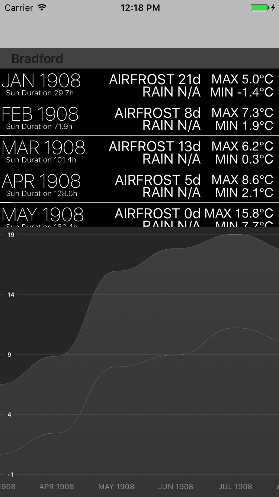

# Meteor
...is a weather app for showing historical weather conditions, tmin, tmax, airfrost, rainfall and day duration for more than 100 year from over 10 British Meteo station, kindly delivered by [Metoffice](http://www.metoffice.gov.uk)



In order to install pods run the following command in projects folder:
```
pod update
```

Supports Xcode 8 and Swift 3
